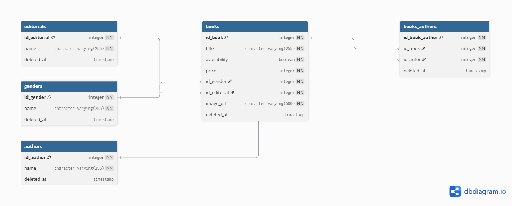

## SQL-BOOKS

Base de datos books

## Tecnologias

Postgresql v16

## Pre requisitos

Tener instalado Postgresql v16 o superior

Tener permisos de super usuario del servidor

## Pasos para implementar

### Desarrollo - Test

Debe ingresar mediante super usuario al servidor de postgresql instalado y ejecutar el script:

1.-script-create-db.sql

### QA - PROD

Debe ingresar mediante super usuario al servidor de postgresql instalado y ejecutar los scripts:

1.-script-create-db.sql

2.-script-create-tables.sql